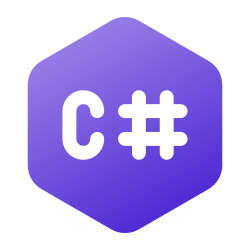
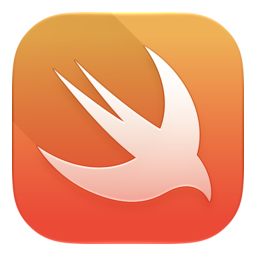
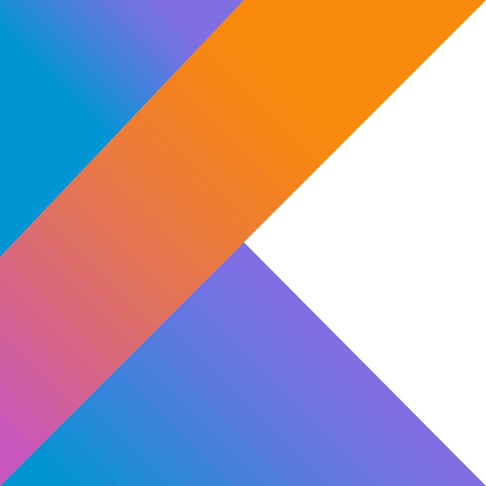
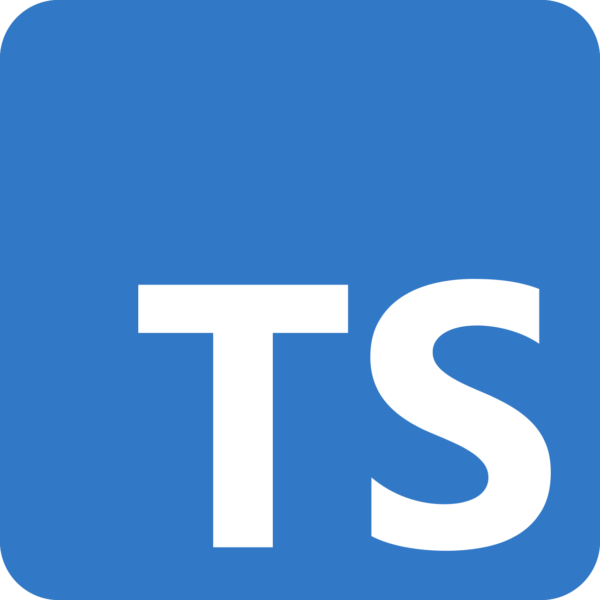
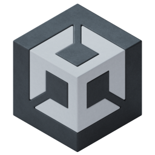

Hello, I'm Igor!

I am a game developer who loves doing low-level game development.

I code mainly in 5 languages, such as:

     

And I also use these IDEs:

    

Currently I'm working on a few projects, such as:

- TDS Macro (A Macro for the game "Tower Defense Simulator" on roblox)
- A Minecraft Clone on Raylib C++
- Much more.

